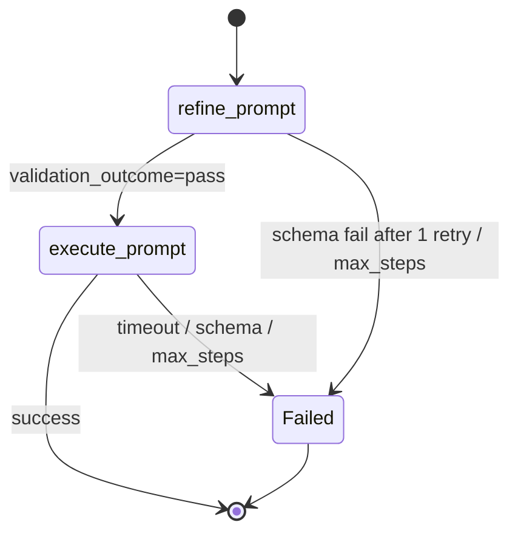

# guardrail-prompt-gateway

A weekend learning demo: **deterministic prompt gates** (schema, allowlist, validators) around a pinned LLM.

This is **not** production prompt-injection defence, **not** a hosted API gateway, **not** a multi-agent platform, and **not** cec-vivisystem or visa-games. The LLM is a component, never source of truth.

Constitution: [docs/ground-rules.md](docs/ground-rules.md). Slice indexes: [phases/slice-0.md](phases/slice-0.md) … [slice-4.md](phases/slice-4.md) (locked tests live in [PROJECT_PLAN.md](docs/PROJECT_PLAN.md)).

**Version:** 0.4.0 (Slice 3 LangGraph refine → execute).

## Language
- Demo UI: Hong Kong Cantonese + English
- Code, docs, commits, ADRs: English only. Never Simplified Chinese.

## Current status
See [PROGRESS.md](PROGRESS.md). Slice 3: local UI at `http://127.0.0.1:8787` runs an explicit 2-node graph (`refine_prompt` → `execute_prompt`). Fake LLM unless keys exist. Not a public gateway. Injection denylist is a demo tripwire, not a jailbreak product.



## Quick start

```bash
uv sync
uv run pytest
uv run ruff check .
uv run python -c "from guardrail_prompt_gateway.hello import main; main()"
uv run python -c "from lib.llm import demo_fake_call; demo_fake_call()"
uv run python -c "from schemas.gateway import GatewayRequest, ProviderEnum; from services.router import complete_request; from lib.llm import FakeLLMClient, TelemetryLLMClient; r=complete_request(GatewayRequest(prompt='hello', provider=ProviderEnum.XAI), client=TelemetryLLMClient(FakeLLMClient())); print(r.outcome, r.provider, r.text)"
```

Copy `.env.example` to `.env` for later live slices. Default tests must stay green with no keys.

Local UI (Fake LLM, no keys):

```bash
GATEWAY_USE_FAKE=true uv run uvicorn --app-dir src app.main:app --host 127.0.0.1 --port 8787
```

Open http://127.0.0.1:8787

## Next
Slice 4 (v0.5.0): `flight_search` allowlist + HITL dry-run. Locked tests T4.1–T4.4.
