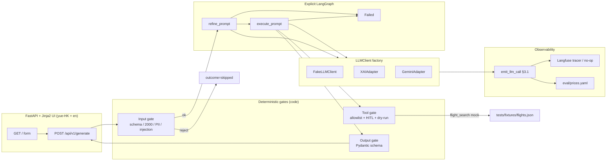
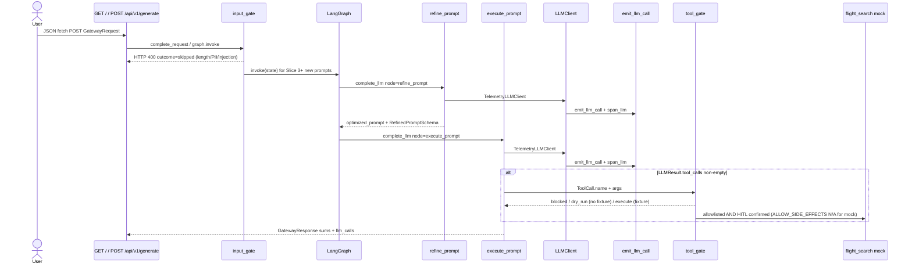
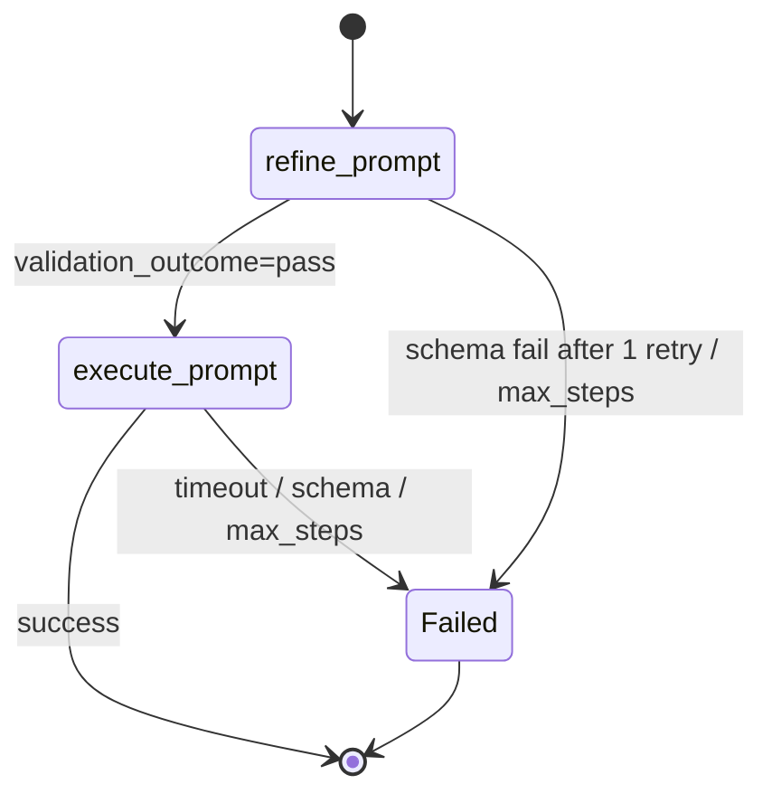
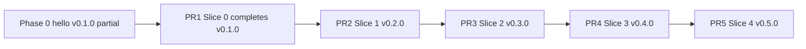

# Guardrail Prompt Gateway — Architecture & Design

| Field | Value |
| --- | --- |
| **Document** | Architecture & design for `guardrail-prompt-gateway` |
| **Author** | Carter Yu (draft via Grok Build) |
| **Date** | 2026-09-11 |
| **Revised** | 2026-09-11 (review 76a5baf8) |
| **Status** | Draft |
| **Version covered** | v0.1.0 → v0.5.0 (Slices 0–4) |
| **Repo** | `/Users/yucarter/my-ai-projects/guardrail-prompt-gateway` |
| **Constitution** | [`docs/ground-rules.md`](ground-rules.md) |
| **Project plan** | [`docs/PROJECT_PLAN.md`](PROJECT_PLAN.md) |
| **Heritage** | cec-vivisystem (spine, logging, HITL) + visa-games (SemVer, honest limits) |

This document is the binding architecture for implementation. Slice scope is still governed by [`docs/PROJECT_PLAN.md`](PROJECT_PLAN.md); this file specifies seams, contracts, layout, and the decisions the plan left open. A phase/slice may narrow **scope**. It may not waive tests, logging, eval gates, or code guardrails.

---

## Overview

`guardrail-prompt-gateway` is a **local Mac Mini** LLM gateway and prompt-optimization service for family/LAN use. It has four jobs, matching the project plan:

1. **Route** a validated request to Google Gemini or xAI (Grok) behind one `LLMClient` protocol.
2. **Optimize** a rough family prompt through an **explicit 2-node LangGraph** (`refine_prompt` → `execute_prompt`), not a hidden agent loop.
3. **Gate** input, tools, and output **in code** (Pydantic schemas, length/PII/injection checks, tool allowlist, HITL + dry-run).
4. **Observe** every model call (fake or live) with constitution §3.1 telemetry and an optional Langfuse span that no-ops when unset.

It is **not** a public cloud gateway, **not** a GDS travel terminal, and **not** production prompt-injection defence. Evaluation uses offline fixtures and a pinned `eval/prices.yaml`. The LLM is a component that transforms under contracts; it is never source of truth.

Implementation lives in `/Users/yucarter/my-ai-projects/guardrail-prompt-gateway`. Phase 0 hello (`src/guardrail_prompt_gateway/`, ADR `0001-dependency-and-tooling.md`, tests H1–H3) is already in this tree. New Slice 0–4 code uses **PROJECT_PLAN paths** (`src/lib/`, `src/schemas/`, `src/services/`, `src/graph/`, `src/tools/`). Hatchling ships **both** the existing hello package and the new packages. See [Key Decisions](#key-decisions) KD-1 through KD-5.

---

## Background & Motivation

### Why this project exists

cec-vivisystem proved a weekend vivisystem can ship with tests, structured logs, ADRs, and human confirmation — and it did so **without an LLM**. visa-games added SemVer and honest capability limits. Neither repo governs model pinning, tool allowlists, structured-output schemas, Fake-LLM unit tests, or per-call token/cost telemetry.

This repo is the first learning/demo product under the AI/LLM constitution (`docs/ground-rules.md`). The family need is small and concrete: type a rough Cantonese/English prompt on the Mac Mini, pick Gemini or Grok, get a structured result, see latency/tokens/cost, and never silently call a side-effecting tool.

### Current state (this repo)

`/Users/yucarter/my-ai-projects/guardrail-prompt-gateway` is the only implementation tree.

| What is there | What it is not |
| --- | --- |
| Phase 0 environment: Python 3.12, `uv`, hatchling package `src/guardrail_prompt_gateway`, `hello` + `logging` (structlog `ConsoleRenderer`), ADR [`0001-dependency-and-tooling.md`](decisions/0001-dependency-and-tooling.md), `docs/philosophy.md`, `docs/PROJECT_PLAN.md`, `docs/architecture.md` (this file), `PROGRESS.md` at **v0.1.0**, tests H1–H3 | **Not** PROJECT_PLAN Slice 0. No `LLMCallTelemetry`, no `eval/prices.yaml`, no `FakeLLMClient`, no JSON §3.1 events. T0.1–T0.4 are **not** done. |
| Plan paths `src/lib/`, `src/schemas/`, … | Not created yet |

v0.1.0 is **not complete** until Slice 0 telemetry (T0.1–T0.4) is green. Phase 0 hello stays; PR 1 adds the telemetry spine without deleting H1–H3.

### Pain points this design closes

- Slice 0 telemetry is unspecified relative to the existing hello logger, so later slices cannot prove §3.1 fields on fake success **and** failure.
- Hatchling currently lists only `src/guardrail_prompt_gateway`; new plan packages would not ship unless `pyproject.toml` is extended.
- Risk of a LangChain “agent” blob (hidden orchestrator — constitution rule 8, forbidden).
- Risk of Streamlit becoming a second runtime next to the FastAPI contract the plan already tests (`/api/v1/generate`).
- PII (HKID, PAN) leaking to a third-party model if the only control is a prompt.

---

## Goals & Non-Goals

### Goals (Slices 0–4, v0.1.0–v0.5.0)

- Keep Phase 0 hello green (H1–H3) while adding Slice 0 telemetry.
- Offline-green `uv run pytest` with Fake LLM; no network; no secrets.
- Unified `LLMClient` seam with injectable Fake LLM and live adapters for `xai` and `google`.
- Input gate: Pydantic schema, max 2000 chars, HKID/PAN block, cheap injection-token reject.
- Explicit LangGraph: two named nodes, typed Pydantic state, `recursion_limit=5`, `max_steps` via `step_count`, visible `Failed` terminal.
- One allowlisted tool (`flight_search`) with mock adapter, dry-run default, HITL confirm.
- FastAPI app + bilingual HK Cantonese + English HTML UI; never Simplified Chinese.
- §3.1 telemetry on every call; `eval/prices.yaml` cost estimate; Langfuse no-op when `LANGFUSE_ENABLED=false`.
- SemVer bump + `PROGRESS.md` per slice; working demo after every PR.
- Bind localhost by default; Mac Mini family LAN is opt-in and still not a public gateway.

### Non-goals (honest limits — constitution rule 21)

- Public multi-tenant auth, TLS termination at the app, DDoS shield, rate-limit-as-a-product.
- Real GDS (Amadeus/Sabre) or paid live travel APIs in the default path. Flight data is fixtures / a sandboxed adapter.
- RAG, vector stores, RAGAS, DeepEval, embeddings, citation contracts. Slices 0–4 do not claim retrieval.
- Streaming UI, multi-turn chat memory as source of truth, unsupervised tool use, shell/HTTP/Python tools.
- Langfuse as a required dependency or source of truth.
- Live billing webhooks; cost is a static table lookup.
- Porting cec-vivisystem Slack/Calendar code or visa-games kiosk code.
- Treating Phase 0 hello (H1–H3) as Slice 0 complete.
- Rewriting or replacing ADR 0001 (tooling).

---

## Key Decisions

### KD-1 — Implementation repo

**Decision:** Implement only in `/Users/yucarter/my-ai-projects/guardrail-prompt-gateway`.

**Rationale:** This is the project tree. Phase 0 is already here. All PRs land here.

### KD-2 — Keep hello; new code follows PROJECT_PLAN paths; hatchling ships both

**Decision:** Do **not** delete or relocate `src/guardrail_prompt_gateway/` (hello, logging, `__version__`). New Slice 0–4 modules use plan paths:

```
src/lib/logger.py
src/lib/prices.py
src/lib/llm.py
src/lib/tracer.py
src/schemas/gateway.py
src/services/router.py
src/graph/state.py
src/graph/optimizer.py
src/tools/flight_search.py
```

Imports for new code: `from lib.logger import emit_llm_call`, `from schemas.gateway import GatewayRequest`. Hello stays `from guardrail_prompt_gateway.hello import main`.

Hatchling default discovery is not enough once multiple top-level packages exist. **ADR 0001 is not overwritten**; this document + `pyproject.toml` extend the package list. pytest `pythonpath` does not fix wheels or uvicorn. Pin this fragment (list only dirs that exist in that slice):

```toml
# pyproject.toml — start of Slice 0 (PR 1). Do not remove the hello package.
[tool.hatch.build.targets.wheel]
packages = [
    "src/guardrail_prompt_gateway",  # Phase 0 hello; keep forever
    "src/lib",                       # Slice 0 telemetry
]

[tool.pytest.ini_options]
pythonpath = ["src"]
testpaths = ["tests"]
```

Append as slices land (never pass missing paths to hatchling): `src/schemas`, `src/services` (PR 2), `src/app` (PR 3), `src/graph` (PR 4), `src/tools` (PR 5).

Uvicorn (Slice 2+): `uv run uvicorn --app-dir src app.main:app --host 127.0.0.1 --port 8787`.

**Logging coexistence:** Phase 0 `guardrail_prompt_gateway.logging.setup_logging` uses `ConsoleRenderer`. Slice 0 `lib.logger.setup_logging` uses JSON for `llm_call`. Both call `structlog.configure`. Do **not** change Phase 0 *application* logging in PR 1 (H1–H3 stay green).

PR 1 **does** edit `tests/conftest.py`: stop calling hello `setup_logging` from `pytest_configure` (H1/H2 already call it; `hello.main` does too). T0 tests use a fixture that calls `lib.logger.setup_logging` and assert on **captured event dicts** (`structlog.testing.capture_logs` or a list processor), not on hello’s console stdout. Unifying renderers is out of Slices 0–4.

**Risk:** Top-level module name `lib` is generic. Acceptable inside an isolated venv. If a collision appears, a later ADR may nest packages without moving hello. Alternative A6 stays rejected for new code.

### KD-3 — Phase 0 hello is not Slice 0 telemetry

**Decision:** v0.1.0 is complete only when T0.1–T0.4 pass. Phase 0 hello + H1–H3 remain. PR 1 **adds** `src/lib` telemetry; it does not replace hello.

**Rationale:** Constitution §3.4 and Slice 0’s locked table require JSON telemetry on fake success **and** failure. `guardrail_prompt_gateway.logging` has no `LLMCallTelemetry`.

### KD-4 — Python 3.12 (already decided)

**Decision:** `requires-python = ">=3.12"`, ruff `target-version = "py312"`. Already Accepted in ADR 0001. Do not reopen.

**Rationale:** Plan says 3.11+. This repo and cec-vivisystem already standardized on 3.12 + uv + ruff + pytest + structlog.

### KD-5 — ADR numbering: 0001 is tooling; plan “0001-multi-model” is filed as 0002

**Decision:** Do **not** overwrite [`docs/decisions/0001-dependency-and-tooling.md`](decisions/0001-dependency-and-tooling.md).

| ADR | File | Slice | Topic |
| --- | --- | --- | --- |
| 0001 | `docs/decisions/0001-dependency-and-tooling.md` | Phase 0 (exists) | Python 3.12, uv, ruff, pytest, structlog, hello package |
| 0002 | `docs/decisions/0002-multi-model-provider-abstraction.md` | 1 | `LLMClient` protocol, xAI default, Gemini route, Fake LLM seam, `complete_llm` / `complete_request` |
| 0003 | `docs/decisions/0003-langgraph-state-machine-topology.md` | 3 | 2-node graph, typed state, `recursion_limit=5` |

PROJECT_PLAN’s filename `0001-multi-model-provider-abstraction.md` is **fulfilled as** `0002-multi-model-provider-abstraction.md` because 0001 is already tooling. Plan Slice 3’s `0002-langgraph-state-machine-topology.md` is fulfilled as **0003**. Hatchling’s extra packages are specified in KD-2 / this file, not by rewriting ADR 0001.

**Do not create** `docs/decisions/0001-multi-model-provider-abstraction.md`. Implementers follow this architecture + the PR Plan file names. The locked *test* tables in PROJECT_PLAN stay authoritative; the ADR *paths* in those checklists are superseded by the table above (one-line erratum in PROJECT_PLAN §3).

**Rationale:** Number collision with the plan is real; the existing Accepted ADR wins the number. Content of the plan ADRs is unchanged.

### KD-6 — UI is FastAPI + Jinja2 HTML, not Streamlit

**Decision:** One `uvicorn` process serves `/api/v1/generate` and `GET /` (Jinja2 templates, Tailwind via CDN). No Streamlit.

**Rationale:** Slice 2’s locked test is an HTTP contract (`T2.1`). The Mac Mini deliverable is `uvicorn`. Streamlit would add a second runtime, hide the schema behind session state, and make `T2.3` (no Simplified Chinese) harder to grep. Tailwind CDN avoids an npm toolchain in a Python weekend repo.

### KD-7 — `LLMClient` protocol is the seam; LangChain is a lazy adapter

**Decision:** Core code depends on `lib.llm.LLMClient`. Vendor SDKs live only in `services/providers.py` and are **lazy-imported inside `get_client`**, never at module import. Default pytest extras do **not** install `langchain-xai` / `langchain-google-genai` (optional extra `[live]`). Tests inject `FakeLLMClient`. `get_client` always returns a `TelemetryLLMClient` wrapping the inner client. Retry and timeout live in `complete_llm` (KD-10), with vendor `max_retries=0` so T1.4 is owned in-process.

xAI adapter order (closed): **try `langchain_xai.ChatXAI` first**; if import or API is awkward, `langchain_openai.ChatOpenAI(base_url=https://api.x.ai/v1)`. Record the winner in **ADR 0002**. Slice 1 ships a **stub** (`error_type=not_implemented` / `missing_credentials`) so the weekend box does not include live SDK bodies.

**Rationale:** Constitution rules 8 and 17. A module-level `from langchain_xai import ChatXAI` runs at collection time. Lazy import + optional extra keeps T1.1 Fake routing offline.

### KD-8 — Default live provider is xAI

**Decision:** `DEFAULT_PROVIDER=xai`, `XAI_API_KEY`, `XAI_BASE_URL=https://api.x.ai/v1` (OpenAI-compatible). Default model id `grok-4.3`. Gemini is the other explicit route (`GOOGLE_API_KEY`, model `gemini-2.5-flash`). Tests never need either key.

**Rationale:** Matches ADR 0001’s forward-looking live default. `grok-4.3` is the current mid-price Grok text model (USD 1.25 / 2.50 per 1M in/out as of 2026-09-07 xAI pricing); constitution’s `grok-4` example is a `model_id` *format*, not a mandate to bill $3/$15 on a family Mini. Both ids live in `eval/prices.yaml`.

### KD-9 — JSON telemetry events for `llm_call`

**Decision:** `emit_llm_call` takes a **strict** Pydantic `LLMCallTelemetry` and emits structlog event `llm_call`. Default renderer for `lib.logger` is JSON (stdout + class-A file). TTY pretty-print is opt-in via `LOG_FORMAT=console`. Constitution rule 16 fields `temperature` and `max_tokens` are included on the structlog event at **DEBUG** and as Langfuse span attributes; INFO omits them. Vendor/Fake dicts never hit the constructor: they go through `telemetry_from_provider` (§4.1).

**Rationale:** T0.1 requires “valid JSON with all mandatory §3.1 fields”. Phase 0 ConsoleRenderer remains on hello. Rule 16 wins over §3.1 “nice to have” for those two fields, but they stay off INFO.

### KD-10 — Split router: `complete_llm` vs `complete_request`

**Decision:** `src/services/router.py` exports two functions. Graph nodes never re-enter the HTTP/input-gate path.

```python
def complete_llm(req: LLMRequest, *, client: LLMClient) -> LLMResult:
    """Provider call + timeout + max 2 retries. `client` is already TelemetryLLMClient-wrapped.
    Does not run input_gate. Both Slice 1 and graph nodes call this."""

def complete_request(request: GatewayRequest, *, client: LLMClient | None = None) -> GatewayResponse:
    """Input gate then complete_llm, mapped to GatewayResponse.
    Slice 1 library path and Slice 2 HTTP. Slice 3+ HTTP uses graph.invoke instead."""
```

- `GatewayRequest` has no `node` / `prompt_version` / `tools`. Those live on `LLMRequest`.
- `execute_prompt` calls `complete_llm` with `node="execute_prompt"` and, in Slice 4, `tools=["flight_search"]`.
- `refine_prompt` calls `complete_llm` with `node="refine_prompt"`, `tools=[]`.
- Retry lives **only** in `complete_llm`. The graph does not retry provider timeouts; it has `max_steps` / `recursion_limit` as a separate budget.
- `LLMRequest.retry_count: int = 0`. `complete_llm` sets it per attempt (`0`, `1`, `2`) via `req.model_copy(update={"retry_count": attempt})` and calls `client.complete(attempt_req)`. **`complete_llm` does not emit `llm_call`.** `TelemetryLLMClient` copies `req.retry_count` onto the event (KD-14). Three timeout failures → three `llm_call` events (`retry_count` 0..2) then `complete_request` maps `outcome=failure` / `ErrorType.TIMEOUT`.
- Tool authorization stays in `execute_prompt` / `tools/gate.py`, not in the router.

After Slice 3, `POST /api/v1/generate` runs `graph.invoke` for new prompts. The Slice 4 confirm path (`confirmed=true` + `confirmation_id`) skips the graph and loads the stored tool args (KD-16 / §4.9).

**Rationale:** A single `complete(GatewayRequest)` cannot carry graph telemetry `node`, cannot pass a tool allowlist, would re-run the input gate on the *optimized* prompt, and would double-retry with `max_steps`. Splitting the seam is the Slice 3/4 architecture, not an implementer invention.

### KD-11 — PII gate **blocks**, it does not redact-and-forward

**Decision:** HKID and payment-card patterns → HTTP 400 / `outcome=skipped`, `error_type=pii_blocked`. The prompt is not sent to any provider. DEBUG truncated previews run *after* the same detectors and still redact.

**Rationale:** Plan T1.3 says “blocks”. Constitution §2.1 allows redact or hash; blocking is the stricter demo and avoids a false sense of safety from partial redaction.

### KD-12 — PROJECT_PLAN is the locked phase/test table

**Decision:** Do not fork a parallel `phases/slice-N.md` that restates T0.1–T4.4. `phases/phase-0-environment.md` already records H1–H3; leave it. Each PR’s description cites the plan section. `PROGRESS.md` records counts.

**Rationale:** Dual locked tables will diverge.

### KD-13 — Bind `127.0.0.1` by default

**Decision:** `uvicorn` host `127.0.0.1`, port `8787`. Family LAN is `BIND=0.0.0.0` in local `.env` only. README states: not a public gateway.

**Rationale:** Honest limits. Opening `0.0.0.0` without auth on a Mini that also runs other family services is an unnecessary default.

### KD-14 — `TelemetryLLMClient` is the only `llm_call` / Langfuse emitter

**Decision:** `FakeLLMClient` is a dumb stub: it returns `LLMResult` or raises; it does not log. `TelemetryLLMClient` wraps any `LLMClient`, and is the **only** caller of `telemetry_from_provider` → `emit_llm_call` and `tracer.span_llm`. `get_client` always wraps. Default `tracer` is `NoOpTracer()` from `src/lib/tracer.py` (Slice 0 ships protocol + no-op only; Langfuse `get_tracer()` waits for Slice 2). Tests T0.1–T0.2 / T2.2 assert on the wrapper. `complete_llm` never calls `emit_llm_call`.

**Rationale:** A “preferred” decorator would be implemented twice by Slice 2. One wrapper prevents double-counting and missed Langfuse spans. Retry counters reach the event via `LLMRequest.retry_count`, not a second emitter.

### KD-15 — Tool calls are structured `ToolCall` objects, never parsed from prose

**Decision:** `ToolCall` is `{name: str, id: str, args: dict}`. A tool proposal exists only if `LLMResult.tool_calls` is non-empty. **Text-only JSON is not a tool call.** FakeLLM scripts return `tool_calls` lists. Live adapters map vendor tool-call payloads into `ToolCall`. `execute_prompt` never `eval`s and never imports a module from a model-supplied name: it looks up `ALLOWLIST_BY_NODE[node]` then a static dict `{"flight_search": tools.flight_search.run}`.

**Rationale:** T4.2 (unlisted tool blocked) is untestable if the proposal channel is “whatever the model wrote in text.”

### KD-16 — Mock `flight_search` is non-side-effecting; HITL still required

**Decision:** Fixture `flight_search` does not ticket anyone, so `ALLOW_SIDE_EFFECTS` does **not** apply to it. The teaching gate is HITL: `confirmed` + `confirmation_id`. `ALLOW_SIDE_EFFECTS` is reserved for a future live/sandbox adapter (out of Slices 0–4). Dry-run vs execute:

| Path | Quotes from fixture | `dry_run` |
| --- | --- | --- |
| propose (`confirmed=false` or missing id) | **not read** | `true` |
| execute (HITL ok) | read | `false` |

T4.1: in-memory store, first propose then `confirmed=true` + id, asserts `FlightQuote`s. T4.4: `confirmed=false` → no fixture read, `quotes` absent, `dry_run=true`.

**Rationale:** Requiring the env flag would make 確認執行 a no-op on the family Mini after Slice 4.

### KD-17 — HTTP token/latency/cost fields are graph sums

**Decision:** After Slice 3, `GatewayResponse.latency_ms`, `token_in`, `token_out`, `estimated_cost_usd` are **sums** across the graph run. `llm_calls: int` is on the response. `prompt_version` is the **execute** prompt (`none` in Slice 0–2; execute node’s version in Slice 3+). Per-call detail stays on `llm_call` log events. T3.1 asserts the HTTP counters equal the sum of the two Fake calls.

**Rationale:** The UI badge must not show only the last node. A list of prompt versions is out of scope for 0–4.

### KD-18 — HTTP `provider` is the requested route; telemetry records the actual client

**Decision:** T1.1 injects Fake and still sends `provider=xai` or `google`. `get_client` was asked for that enum (assert in test). `GatewayResponse.provider` remains the **request** enum. `GatewayResponse.model_id` is the requested model id (`grok-4.3` / `gemini-2.5-flash`); `model_id="fake"` only when `ProviderEnum.FAKE`. Telemetry `provider` / `model_id` are the **actual** inner client (`fake` / `fake` in default pytest), per constitution §3.1.

**Rationale:** The family toggle is “I asked for Grok”; AIOps must say a Fake ran. Mixing those in one field breaks either T1.1 or T0.1.

---

## Proposed Design

### 1. Target shape



Phase mapping: Slice 0 = Obs + Fake (hello already shipped); Slice 1 = In + Providers + router; Slice 2 = UI + Langfuse; Slice 3 = Graph; Slice 4 = Tool.

### 2. Repository layout

Existing Phase 0 files stay. * = new in Slices 0–4.

```
README.md
PROGRESS.md
.env.example
pyproject.toml                  # extend hatchling packages; do not drop hello
uv.lock
docs/ground-rules.md
docs/PROJECT_PLAN.md
docs/architecture.md            # this file
docs/philosophy.md              # exists; not a Slice 0 blocker
docs/decisions/0001-dependency-and-tooling.md   # exists; do not overwrite
docs/decisions/0002-multi-model-provider-abstraction.md   # * Slice 1
docs/decisions/0003-langgraph-state-machine-topology.md   # * Slice 3
phases/phase-0-environment.md   # exists (H1–H3)
prompts/prompt_refiner.v1.md    # *
eval/prices.yaml                # *
eval/golden/
src/guardrail_prompt_gateway/   # Phase 0 hello — keep
  __init__.py
  hello.py
  logging.py
src/lib/                        # * Slice 0
  __init__.py
  logger.py                     # setup_logging, telemetry_from_provider, emit_llm_call
  prices.py
  llm.py                        # LLMClient, LLMResult, ToolCall, FakeLLMClient, TelemetryLLMClient
  clock.py
  tracer.py                     # Slice 0: Tracer protocol + NoOpTracer; Slice 2 adds get_tracer/Langfuse
src/schemas/                    # * Slice 1
src/services/                   # * Slice 1
src/graph/                      # * Slice 3
src/tools/                      # * Slice 4
src/app/                        # * Slice 2
tests/conftest.py               # PR 1: stop global hello setup_logging; T0 capture fixture
tests/test_hello.py             # H1–H3 — keep
tests/test_telemetry.py         # * T0.1–T0.4
tests/test_router.py            # * T1.1–T1.4
tests/test_input_gate.py
tests/test_api.py
tests/test_i18n.py
tests/test_graph.py
tests/test_flight_search.py
tests/fixtures/flights.json
scripts/purge_logs.py
logs/                           # gitignored
data/confirmations/             # gitignored; class C from Slice 4
```

### 3. Request lifecycle (Slice 3+ happy path)



Confirm path (Slice 4, not shown): `confirmed=true` + `confirmation_id` **skips the graph**, loads `ConfirmationRecord.args`, runs the tool gate once.

### 4. Component contracts

#### 4.1 Telemetry logger — `src/lib/logger.py` (Slice 0)

Boundary fields (cec + constitution §3): `timestamp`, `level`, `component`, `event`, `outcome`, `duration_ms`, `error_type`, `error_message`, `correlation_id`.

Per model invocation, additionally the §3.1 required set. Fake LLM uses the same schema with `provider="fake"`, `model_id="fake"`.

```python
# src/lib/logger.py (contract sketch)
class LLMCallTelemetry(BaseModel):
    # flow
    timestamp: datetime
    level: Literal["info", "warning", "error"] = "info"
    component: str = "llm_client"
    event: Literal["llm_call"] = "llm_call"
    outcome: Literal["success", "failure", "partial", "skipped"]
    duration_ms: int
    correlation_id: str
    error_type: str | None = None
    error_message: str | None = None
    # §3.1 required
    provider: Literal["xai", "google", "openai", "anthropic", "local", "fake"]
    model_id: str
    prompt_version: str
    node: str
    latency_ms: int
    token_in: int
    token_out: int
    token_total: int
    finish_reason: Literal["stop", "length", "tool_calls", "content_filter", "error"]
    stream: bool = False
    retry_count: int = 0
    # §3.1 when known
    provider_request_id: str | None = None
    token_cached: int | None = None
    ttft_ms: int | None = None
    estimated_cost_usd: float = 0.0
    price_table_version: str
    # graph (optional until Slice 3)
    graph_run_id: str | None = None
    step: int | None = None
    tool: str | None = None
    tool_call_id: str | None = None
    validation_outcome: Literal["pass", "retry", "fail"] | None = None
    # rule 16 — DEBUG / Langfuse only; emit_llm_call still accepts them
    temperature: float | None = None
    max_tokens: int | None = None

SLICE0_NODE = "complete"
SLICE0_PROMPT_VERSION = "none"

def telemetry_from_provider(raw: dict[str, Any], **defaults: Any) -> LLMCallTelemetry:
    """The only entry that sees vendor/Fake dicts. Never raises (T0.4).
    Missing token_* → 0; missing finish_reason → 'error'; unknown keys ignored;
    node default SLICE0_NODE; prompt_version default SLICE0_PROMPT_VERSION;
    price_table_version from PriceTable.version; timestamp = Clock.now() (HKT).
    """

def emit_llm_call(tel: LLMCallTelemetry) -> None:
    """Strict. Raises if `tel` is not a valid model. Tests T0.1 assert JSON fields
    on the structlog event, not on constructing this type from garbage.
    INFO omits temperature/max_tokens; DEBUG includes them.
    """

def setup_logging(*, level: str = "INFO", log_dir: Path | None = None) -> None: ...
```

**Slice 0 sentinels** (T0.1-valid event with no graph and no prompt file):

| Field | Slice 0 value | Later overwrite |
| --- | --- | --- |
| `node` | `"complete"` | Slice 3: `refine_prompt` / `execute_prompt` |
| `prompt_version` | `"none"` | Slice 3 refine: `prompt_refiner.v1`; HTTP `prompt_version` is the execute value (KD-17) |
| `provider` | `"fake"` (actual client; KD-18) | live adapters when `[live]` extra is used |
| `model_id` | `"fake"` | live model id |
| `price_table_version` | `eval/prices.yaml` `version` (`"2026-09-11"`) | when YAML bumps |

Rules:

- `latency_ms` is copied onto `duration_ms`.
- `token_total = token_in + token_out` (plus cache write only if the provider splits it; we do not invent cache tokens).
- `estimated_cost_usd` is `round(token_in/1e6 * input_usd + token_out/1e6 * output_usd, 6)` from `PriceTable`. Unknown `model_id` → `0.0` and a WARNING (`T0.3`).
- **T0.4 calls `telemetry_from_provider`, not `LLMCallTelemetry(...)`.** Coerce never raises; `emit_llm_call` stays strict so T0.1 does not weaken the model.
- **Timestamps:** `LLMCallTelemetry.timestamp` is timezone-aware **HKT** from `Clock.now()`. structlog `TimeStamper` stays **UTC ISO** (same as Phase 0 hello). Tests pin the clock and **must not** assert the two clocks are equal.
- Never log API keys, full prompts, raw completions, HKID, PAN, emails at INFO. DEBUG preview ≤ 200 chars, already redacted.
- Class A file sink (`logs/llm_client-YYYY-MM-DD.log`) may wait until Slice 2. Slice 0 stdout JSON is enough; tests capture structlog events rather than scraping ANSI.

`src/lib/prices.py` loads `eval/prices.yaml` once (path relative to repo root, injectable in tests).

```yaml
# eval/prices.yaml
version: "2026-09-11"
currency: USD
unit: per_1m_tokens
models:
  fake:
    provider: fake
    input_usd: 0.0
    output_usd: 0.0
  grok-4.3:
    provider: xai
    input_usd: 1.25
    output_usd: 2.50
  grok-4:
    provider: xai
    input_usd: 3.00
    output_usd: 15.00
  grok-build-0.1:
    provider: xai
    input_usd: 1.00
    output_usd: 2.00
  gemini-2.5-flash:
    provider: google
    input_usd: 0.30
    output_usd: 2.50
  gemini-2.0-flash:
    provider: google
    input_usd: 0.10
    output_usd: 0.40
```

These figures are **pinned for reproducibility**, not live billing. Update the YAML + `version` when prices change; tests that need a number use this file, not vendor HTTP.

#### 4.2 Fake LLM — `src/lib/llm.py` (Slice 0, used by every later slice)

```python
class Message(BaseModel):
    role: Literal["system", "developer", "user", "assistant", "tool"]
    content: str

class LLMRequest(BaseModel):
    messages: list[Message]
    model_id: str
    prompt_version: str
    node: str
    correlation_id: str
    temperature: float = 0.0
    max_tokens: int = 1024
    timeout_s: float = 30.0
    tools: list[str] = Field(default_factory=list)  # allowlist names only
    retry_count: int = 0  # set by complete_llm per attempt; wrapper copies onto llm_call

class ToolCall(BaseModel):
    name: str
    id: str
    args: dict[str, Any] = Field(default_factory=dict)

class LLMResult(BaseModel):
    text: str
    model_id: str
    provider: str
    finish_reason: str
    token_in: int
    token_out: int
    provider_request_id: str | None = None
    tool_calls: list[ToolCall] = Field(default_factory=list)
    raw_usage: dict[str, Any] = Field(default_factory=dict)

class LLMClient(Protocol):
    provider: str
    def complete(self, req: LLMRequest) -> LLMResult: ...

class TelemetryLLMClient:
    """Sole emitter (KD-14). Wraps any LLMClient. Slice 0: tracer defaults to NoOpTracer."""
    def __init__(
        self,
        inner: LLMClient,
        *,
        tracer: Tracer | None = None,  # lib.tracer.Tracer; default NoOpTracer(); no Langfuse import
        clock: Clock | None = None,
        prices: PriceTable | None = None,
    ) -> None: ...
    def complete(self, req: LLMRequest) -> LLMResult:
        # time inner.complete; on success or exception build raw dict;
        # tel = telemetry_from_provider(raw, node=req.node, retry_count=req.retry_count, ...);
        # emit_llm_call(tel); tracer.span_llm(tel)  # no-op in Slice 0
        # re-raise so complete_llm can retry timeouts
        ...
```

Slice 0 `src/lib/tracer.py` (no Langfuse, no `get_tracer` yet):

```python
class Tracer(Protocol):
    def span_llm(self, tel: Any, **attrs: Any) -> None: ...
    def span_tool(self, *, tool: str, correlation_id: str, dry_run: bool) -> None: ...

class NoOpTracer:
    def span_llm(self, tel: Any, **attrs: Any) -> None: return
    def span_tool(self, **kwargs: Any) -> None: return
```

`FakeLLMClient` (dumb stub — **no logging**):

- No network. Constructor takes `script: dict[str, LLMResult] | Callable[[LLMRequest], LLMResult]`.
- **Script keys are `node` names** (`"complete"`, `"refine_prompt"`, `"execute_prompt"`). Lookup: `script[req.node]`. Optional `Callable` for prompt-substring branches (T3.1 Osaka). There is no keying by `correlation_id`.
- Default (no script): `provider="fake"`, `model_id="fake"`, `token_in=0`, `token_out=0`, `finish_reason="stop"`, `tool_calls=[]`, text **`"Hello from Fake LLM. （假模型回覆）"`** — not `{"ok": true}`, so Slice 2/3 UI does not render a JSON blob. Tests that need JSON (refine node) pass a script.
- `fail_next: Exception | None` (or a remaining-fail counter for T1.4): inner raises; the **wrapper** still emits `finish_reason="error"`, tokens present (0 if unknown).
- T0.1–T0.2 wrap Fake in `TelemetryLLMClient` before calling `complete`.

Clock: `src/lib/clock.py` exposes `Clock` with `now() -> datetime` tz `Asia/Hong_Kong`. Tests pin `datetime(2026, 9, 11, 12, 0, tzinfo=ZoneInfo("Asia/Hong_Kong"))`. Do not assert equality with structlog UTC `timestamp`.

#### 4.3 Input / output schemas — `src/schemas/gateway.py` (Slice 1)

```python
class ProviderEnum(StrEnum):
    XAI = "xai"
    GOOGLE = "google"
    FAKE = "fake"

class ErrorType(StrEnum):
    """Never free-typed in nodes. Extend this enum per slice; tests assert members."""
    PII_BLOCKED = "pii_blocked"                     # Slice 1
    PROMPT_TOO_LONG = "prompt_too_long"             # Slice 1
    INJECTION_TOKEN = "injection_token"             # Slice 1
    TIMEOUT = "timeout"                             # Slice 1
    MISSING_CREDENTIALS = "missing_credentials"     # Slice 1 stub
    NOT_IMPLEMENTED = "not_implemented"             # Slice 1 live-adapter stub
    PROVIDER_ERROR = "provider_error"               # Slice 1
    SCHEMA_INVALID = "schema_invalid"               # Slice 3
    MAX_STEPS_EXCEEDED = "max_steps_exceeded"       # Slice 3
    TOOL_BLOCKED = "tool_blocked"                   # Slice 4
    EMPTY_TOOL_RESULT = "empty_tool_result"         # Slice 4
    UNKNOWN_CONFIRMATION = "unknown_confirmation"   # Slice 4
    ALREADY_EXECUTED = "already_executed"           # Slice 4
    EXPIRED_CONFIRMATION = "expired_confirmation"   # Slice 4

class GatewayRequest(BaseModel):
    prompt: str = Field(default="", max_length=2000)
    provider: ProviderEnum = ProviderEnum.XAI
    model_id: str | None = None          # default from env per provider
    confirmed: bool = False
    confirmation_id: str | None = None   # Slice 4; second POST is this + confirmed=true only
    correlation_id: str | None = None    # generated if omitted
    # No tool-args field. Confirm loads stored FlightSearchArgs (KD-16 / §4.9).

    @model_validator(mode="after")
    def prompt_required_unless_confirming(self) -> Self:
        if self.confirmation_id:
            return self
        if not self.prompt.strip():
            raise ValueError("prompt required unless confirmation_id is set")
        return self

class GatewayResponse(BaseModel):
    outcome: Literal["success", "failure", "skipped"]
    text: str | None = None
    provider: ProviderEnum                 # requested route (KD-18)
    model_id: str                          # requested id; "fake" only if provider=FAKE
    prompt_version: str                    # execute prompt, or "none" pre-Slice 3 (KD-17)
    correlation_id: str
    latency_ms: int                        # graph SUM (KD-17)
    token_in: int                          # graph SUM
    token_out: int                         # graph SUM
    estimated_cost_usd: float              # graph SUM
    llm_calls: int = 1                     # Slice 0–2: 1; Slice 3+: count of complete_llm
    finish_reason: str | None = None       # last node
    error_type: ErrorType | None = None
    error_message: str | None = None
    dry_run: bool = False
    tool: str | None = None
    confirmation_id: str | None = None     # Slice 4 propose
    proposed_args: "FlightSearchArgs | None" = None
    quotes: list["FlightQuote"] | None = None
    refined: "RefinedPromptSchema | None" = None  # Slice 3+
```

Pydantic `max_length=2000` is the schema half of the length gate. The service layer still logs `outcome=skipped` with `ErrorType.PROMPT_TOO_LONG` for oversize payloads that bypass validation (raw JSON). **Reject, do not truncate.**

#### 4.4 Input gate — `src/services/input_gate.py` (Slice 1)

Order: schema → length → PII → injection tokens. First failure wins. Log `component=input_gate`, `event=input_rejected`, `outcome=skipped`.

**Length:** `len(prompt) > 2000` → skipped (`T1.2`), `ErrorType.PROMPT_TOO_LONG`. Count Python characters, not tokens.

**HKID (block):** 1–2 letters, 6 digits, check digit `0-9` or `A`, optional parentheses around the check digit.

```text
\b[A-Za-z]{1,2}\d{6}(?:[\dA]|[\(\（][\dA][\)\）])\b
```

Fixtures: `A123456(7)`, `AB123456(A)`, `A1234567`. Do not log the match; log `pii_type=hkid`, `ErrorType.PII_BLOCKED`.

**Payment card (block):** 13–19 digits with optional spaces/dashes, then **Luhn**. Bare 16-digit runs that fail Luhn are not blocked. Fixtures: `4111 1111 1111 1111` (Visa test PAN). Log `pii_type=pan`, `ErrorType.PII_BLOCKED`.

**Injection tokens (block, cheap):** case-insensitive substring list:

- `ignore previous instructions`
- `ignore all previous`
- `<|system|>`
- `</system>`
- `[INST]`
- `developer mode`

This is a **demo tripwire**, not a jailbreak product. Document that in README. On hit: `ErrorType.INJECTION_TOKEN`, `outcome=skipped`.

#### 4.5 Router & provider factory — `src/services/router.py`, `src/services/providers.py` (Slice 1)

```python
def get_client(
    provider: ProviderEnum,
    *,
    fake: LLMClient | None = None,
    model_id: str | None = None,
    tracer: Tracer | None = None,
) -> LLMClient:
    """Always returns TelemetryLLMClient(inner).
    If fake is passed, inner=fake (T1.1).
    Elif provider is FAKE, inner=FakeLLMClient().
    Else inner=_live_or_stub(provider, model_id)  # lazy import; stub in Slice 1.
    """

def _live_or_stub(provider: ProviderEnum, model_id: str | None) -> LLMClient:
    """Slice 1: no vendor SDK body. If key missing → StubLLMClient(MISSING_CREDENTIALS).
    If extra [live] not installed → StubLLMClient(NOT_IMPLEMENTED).
    Lazy import of ChatXAI / ChatGoogleGenerativeAI is allowed here but the
    method bodies wait for a later live-smoke slice (out of 0–4).
    """

def complete_llm(req: LLMRequest, *, client: LLMClient) -> LLMResult:
    """Timeout + max 2 retries around client.complete. No input_gate. No tools fired.
    Does not emit llm_call. Sets req.retry_count per attempt so the wrapper logs 0..2.
    """
    last: BaseException | None = None
    for attempt in range(0, 1 + MAX_RETRIES):  # 0, 1, 2
        attempt_req = req.model_copy(update={"retry_count": attempt})
        try:
            return client.complete(attempt_req)
        except TimeoutError as e:
            last = e
            continue
        # non-timeout: wrapper already emitted finish_reason=error; do not retry
        except Exception:
            raise
    raise last  # complete_request maps to ErrorType.TIMEOUT

def complete_request(request: GatewayRequest, *, client: LLMClient | None = None) -> GatewayResponse:
    """Input gate then complete_llm with node='complete', prompt_version='none'.
    Slice 1–2 only. Graph nodes must not call this.
    """
```

Retry policy (constitution rule 20, T1.4) — **only** in `complete_llm`:

- Provider **timeout** / transient transport error: retry up to **2 times** (3 attempts total). Each attempt is a `client.complete` with `retry_count` 0..2; the wrapper emits one `llm_call` per attempt. `complete_llm` itself does **not** emit.
- Non-timeout 4xx / other exceptions from provider: **do not** retry.
- After exhaustion: `complete_request` maps to `outcome=failure`, `ErrorType.TIMEOUT` (or `PROVIDER_ERROR`), log ERROR. No silent swallow. T1.4 asserts three `llm_call` events then HTTP/library `outcome=failure`.
- Idempotent: same `correlation_id`, no tools fired in Slice 1.
- Timeouts via `timeout_s=30` on the HTTP client we own.
- Graph `max_steps` is a **separate** budget and does not retry `complete_llm`.

Live adapters (Slice 1 = **stubs**; optional extra `[live]` not required for pytest):

| Provider | Env | Slice 1 inner | Default `model_id` |
| --- | --- | --- | --- |
| `xai` | `XAI_API_KEY`, `XAI_BASE_URL=https://api.x.ai/v1` | stub; later `langchain_xai.ChatXAI` (fallback `ChatOpenAI(base_url=…)`) | `grok-4.3` |
| `google` | `GOOGLE_API_KEY` | stub; later `ChatGoogleGenerativeAI` | `gemini-2.5-flash` |
| `fake` | none | `FakeLLMClient` | `fake` |

T1.1: inject Fake; assert `get_client` was asked for `google` or `xai`; `GatewayResponse.provider` is that request enum; `model_id` is the requested default; telemetry `provider=fake`. Missing key on a non-injected live path: `ErrorType.MISSING_CREDENTIALS`.

Temperature default **0**. `max_tokens` default 1024. Both on the DEBUG `llm_call` event and Langfuse attrs, not INFO (KD-9).

#### 4.6 HTTP API & UI — `src/app/` (Slice 2)

```python
# src/app/main.py
def create_app(
    *,
    llm_factory=get_client,
    tracer=None,
    graph=None,
    confirmation_store=None,
) -> FastAPI:
    """Slice 2: llm_factory + tracer. Slice 3: graph = build_graph(get_client_fn=llm_factory)
    when graph is omitted. Slice 4: confirmation_store defaults to JsonDir for uvicorn;
    tests pass InMemoryConfirmationStore.
    """

def generate(request: GatewayRequest) -> GatewayResponse:
    # Slice 4: if request.confirmation_id and request.confirmed:
    #     return execute_confirmation(store, request)  # no graph, no complete_llm; llm_calls=0
    # Slice 3+: input_gate then graph.invoke
    # Slice 2: complete_request(...)

app = create_app()
# uv run uvicorn --app-dir src app.main:app --host 127.0.0.1 --port 8787
```

Handlers are **sync `def`**, not `async def`. `LLMClient.complete` is sync; a live call is 2–8 s. Starlette runs sync endpoints in a threadpool. Family load is 1–2 users, one uvicorn worker. **Do not add `ainvoke` in Slices 0–4.**

`TestClient` injects Fake via `create_app(llm_factory=lambda provider, **kw: TelemetryLLMClient(FakeLLMClient(script=...)))`. Slice 3 tests pass the same factory so `build_graph(get_client_fn=llm_factory)` never constructs a live stub.

| Method | Path | Role |
| --- | --- | --- |
| `GET` | `/` | Bilingual form (`index.html`). Form does **not** POST urlencoded to the API. |
| `GET` | `/health` | `{status: ok, version, langfuse: bool}` |
| `POST` | `/api/v1/generate` | JSON body = `GatewayRequest`; JSON `GatewayResponse` |

**HTTP status table:**

| `outcome` | HTTP | When |
| --- | --- | --- |
| `success` | 200 | Model (and optional tool execute) finished |
| `skipped` | 400 | Input gate: length / PII / injection; also Slice 4 unknown/expired confirmation / already_executed |
| `failure` | **200** | Provider timeout, `max_steps`, schema fail after retry. Body carries `error_type`. **Not 500/504** — the UI renders the error on the same card |

UI: small inline `fetch` in `index.html` (`Content-Type: application/json`). No `form method=POST action=/api/v1/generate` — that would 422. PR 3 includes this script so the Mac Mini demo matches T2.1.

T2.1: 200 + schema. Oversize/PII: 400 + `outcome=skipped`. Map FastAPI `RequestValidationError` (e.g. prompt > 2000) to the same 400/`PROMPT_TOO_LONG` body so the Mini form never sees a raw 422.

UI copy (frozen in `src/app/i18n.py`; T2.3 scans this catalog):

| Key | yue-HK + en |
| --- | --- |
| `prompt_label` | 輸入提示詞 (Enter Prompt) |
| `model_label` | 選擇模型 (Select Model) |
| `submit` | 送出 (Submit) |
| `confirm` | 確認執行 (Confirm) |
| `telemetry` | 耗時 (Latency) \| 消耗 Token (Tokens) \| 預估成本 (Cost) |
| `dry_run` | 模擬執行 (Dry run) |
| `provider_xai` | xAI (Grok) |
| `provider_google` | Google Gemini |

T2.3 strategy (plan: “UI strings”): (1) exact-string assertions on the catalog above; (2) grep **`src/app/i18n.py` and `src/app/templates/`** (and Slice 4 user-visible refuse strings in `src/tools/flight_search.py`) for the simplified-only denylist (`输入`, `选择`, `提交`, `耗时`, `预估`, `确认`). Engineering artifacts stay English.

Telemetry badge reads `latency_ms`, `token_in+token_out`, `estimated_cost_usd`, `llm_calls` from the JSON. After Slice 3 those JSON fields are **sums** (KD-17).

#### 4.7 Tracer — `src/lib/tracer.py` (protocol in Slice 0; Langfuse in Slice 2)

Slice 0 ships `Tracer` + `NoOpTracer` only (see §4.2). `TelemetryLLMClient` type-depends on that protocol, **not** on Langfuse. Slice 2 **adds** `get_tracer()` to the same file (lazy Langfuse import). Do not import Langfuse in Slice 0.

```python
def get_tracer() -> Tracer:  # Slice 2
    if os.getenv("LANGFUSE_ENABLED", "false").lower() not in {"1", "true", "yes"}:
        return NoOpTracer()
    # lazy import langfuse; if import/keys fail → NoOpTracer + WARNING
```

Rules:

- App **starts** if Langfuse env is missing (T2.2). Missing SDK is not a boot failure.
- Map `correlation_id` → Langfuse `trace_id` / `session_id`.
- Span attributes reuse §3.1 field names.
- User input attribute: already-redacted preview, **max 200 characters**.
- Langfuse is class T. Observability, not SoT.

`.env.example` (extend the existing file; keep current placeholders):

```
LOG_LEVEL=INFO
LOG_FORMAT=json
BIND=127.0.0.1
PORT=8787
DEFAULT_PROVIDER=xai
DEFAULT_XAI_MODEL=grok-4.3
DEFAULT_GEMINI_MODEL=gemini-2.5-flash
XAI_API_KEY=
XAI_BASE_URL=https://api.x.ai/v1
GOOGLE_API_KEY=
LANGFUSE_ENABLED=false
LANGFUSE_PUBLIC_KEY=
LANGFUSE_SECRET_KEY=
LANGFUSE_HOST=
ALLOW_SIDE_EFFECTS=false
MAX_PROMPT_CHARS=2000
LLM_TIMEOUT_S=30
LLM_MAX_RETRIES=2
GRAPH_RECURSION_LIMIT=5
GRAPH_MAX_STEPS=5
MAX_TOKENS=1024
TEMPERATURE=0
```

#### 4.8 LangGraph optimizer — `src/graph/` (Slice 3)



Typed state (`src/graph/state.py`):

```python
class OptimizerState(BaseModel):
    raw_prompt: str
    optimized_prompt: str | None = None
    refined: RefinedPromptSchema | None = None
    model_target: ProviderEnum
    model_id: str
    step_count: int = 0
    max_steps: int = 5
    confirmed: bool = False
    confirmation_id: str | None = None
    correlation_id: str
    graph_run_id: str
    outcome: Literal["success", "failure", "skipped"] | None = None
    last_error_type: str | None = None
    response: GatewayResponse | None = None
```

`RefinedPromptSchema` (`src/schemas/refined.py`):

```python
class RefinedPromptSchema(BaseModel):
    objective: str
    origin: str | None = None
    destination: str | None = None
    departure_date: date | None = None
    return_date: date | None = None
    constraints: list[str] = Field(default_factory=list)
    language: Literal["yue-HK", "en", "mixed"] = "mixed"
```

Nodes (`src/graph/optimizer.py`) — pin `langgraph` in PR 4 / **ADR 0003**:

```python
def build_graph(*, get_client_fn=get_client, complete_llm_fn=complete_llm):
    """Close over get_client_fn / complete_llm_fn so pytest injects Fake (T3.1).
    create_app(llm_factory=...) calls build_graph(get_client_fn=llm_factory) when graph is omitted.
    """
    def refine_prompt(state: OptimizerState) -> dict:
        client = get_client_fn(state.model_target, model_id=state.model_id)
        # complete_llm_fn(... node='refine_prompt' ...); parse RefinedPromptSchema
        step = state.step_count + 1
        updates = {"step_count": step, "refined": refined, "optimized_prompt": ...}
        if refined is None:
            updates["last_error_type"] = ErrorType.SCHEMA_INVALID
        elif step >= state.max_steps:
            updates["last_error_type"] = ErrorType.MAX_STEPS_EXCEEDED
        return updates

    def execute_prompt(state: OptimizerState) -> dict:
        client = get_client_fn(state.model_target, model_id=state.model_id)
        # complete_llm_fn(... node='execute_prompt' ...)
        step = state.step_count + 1
        updates = {"step_count": step, ...}
        if step >= state.max_steps:
            updates["last_error_type"] = ErrorType.MAX_STEPS_EXCEEDED
        return updates

    def failed_node(state: OptimizerState) -> dict:
        err = state.last_error_type or ErrorType.MAX_STEPS_EXCEEDED
        return {
            "outcome": "failure",
            "last_error_type": err,
            "response": GatewayResponse(..., outcome="failure", error_type=err, llm_calls=...),
        }

    def route_after_refine(state: OptimizerState) -> Literal["execute_prompt", "failed"]:
        if state.step_count >= state.max_steps:
            return "failed"
        if state.refined is None:
            return "failed"
        return "execute_prompt"

    def route_after_execute(state: OptimizerState) -> Literal["end", "failed"]:
        if state.outcome == "failure" or state.step_count >= state.max_steps:
            return "failed"
        return "end"

    g = StateGraph(OptimizerState)
    g.add_node("refine_prompt", refine_prompt)
    g.add_node("execute_prompt", execute_prompt)
    g.add_node("failed", failed_node)
    g.set_entry_point("refine_prompt")
    g.add_conditional_edges("refine_prompt", route_after_refine, {
        "execute_prompt": "execute_prompt",
        "failed": "failed",
    })
    g.add_conditional_edges("execute_prompt", route_after_execute, {
        "end": END,
        "failed": "failed",
    })
    g.add_edge("failed", END)
    return g.compile(recursion_limit=5)
```

1. **`refine_prompt`** — loads `prompts/prompt_refiner.v1.md`. Calls **`complete_llm_fn`** (not `complete_request`) with `node="refine_prompt"`, `prompt_version="prompt_refiner.v1"`, `tools=[]`, `temperature=0`, `client=get_client_fn(...)`. Parses JSON → `RefinedPromptSchema`. On validation failure: **one** retry with the validator error appended, then set `refined=None` / `last_error_type=SCHEMA_INVALID`. Increments `step_count` once per node visit (schema retry counts as the same visit). **After incrementing**, if `step_count >= max_steps` **and** schema passed, set `last_error_type=MAX_STEPS_EXCEEDED` even when `refined` is valid. Conditional edges do not mutate state.
2. **`execute_prompt`** — user message = serialized refined JSON + original raw as untrusted data, clearly delimited. Calls **`complete_llm_fn`** with `node="execute_prompt"`, `tools=["flight_search"]` in Slice 4 else `[]`. Increments `step_count`; same max-steps assignment. Slice 4: inspect `LLMResult.tool_calls` only (KD-15).
3. **`failed`** — sets `outcome="failure"` and copies `last_error_type` onto `GatewayResponse.error_type` (default `MAX_STEPS_EXCEEDED` if still None). Terminal.

**T3.2 recipe:** `build_graph(get_client_fn=lambda provider, **kw: TelemetryLLMClient(FakeLLMClient(script=...)))`, invoke `OptimizerState(max_steps=1, raw_prompt="find me tickets to Osaka", ...)`. `refine_prompt` may produce a valid `refined`, increments `step_count` to 1, sets `last_error_type=MAX_STEPS_EXCEEDED`; `route_after_refine` returns `"failed"`; `failed_node` copies that type onto `state.response` / `GatewayResponse.error_type`. Assert `outcome=failure`, `error_type=max_steps_exceeded`, test finishes (no hang). Alternate Fake that always fails `RefinedPromptSchema` after one schema retry → `SCHEMA_INVALID` (T3.3 failure cousin, not T3.2).

Guardrails:

- `recursion_limit=5` **and** `step_count >= max_steps` in the routers. Two layers so a library default cannot loop.
- No dynamic tool inventory. No supervisor node. No unbounded fan-out.
- Fake LLM `script` keyed by node: `"refine_prompt"` → JSON `{objective, origin: "HKG", destination: "KIX", departure_date: "2026-10-01", ...}`; `"execute_prompt"` → bilingual stub text (and Slice 4 `tool_calls`).
- HTTP mapping: counters = **sums** of the two `complete_llm` calls; `llm_calls=2` on T3.1 success; `prompt_version` = execute’s version (KD-17).

Prompt file: English developer instructions; user text is untrusted; require JSON matching `RefinedPromptSchema`. Tools are gated in code.

#### 4.9 Flight tool + HITL — `src/tools/` (Slice 4)

```python
class FlightSearchArgs(BaseModel):
    origin: str = Field(..., min_length=3, max_length=4)
    destination: str = Field(..., min_length=3, max_length=4)
    departure_date: date

class FlightQuote(BaseModel):
    carrier: str
    flight_number: str
    origin: str
    destination: str
    departure_iso: str
    price_hkd: int

class FlightSearchResult(BaseModel):
    quotes: list[FlightQuote]
    source: Literal["fixture", "sandbox"]
    dry_run: bool
```

Tool gate (`src/tools/gate.py`):

```python
ALLOWLIST_BY_NODE = {
    "execute_prompt": frozenset({"flight_search"}),
    "refine_prompt": frozenset(),
}

TOOL_IMPL = {"flight_search": flight_search.run}  # static; never built from model text

def authorize_tool(
    *,
    node: str,
    tool_name: str,
    confirmed: bool,
    confirmation_id: str | None,
) -> Literal["execute", "dry_run", "blocked"]:
    if tool_name not in ALLOWLIST_BY_NODE.get(node, ()):
        return "blocked"
    if not confirmed or not confirmation_id:
        return "dry_run"
    return "execute"
    # ALLOW_SIDE_EFFECTS is NOT consulted for mock flight_search (KD-16).
```

| Condition | Result | Log event |
| --- | --- | --- |
| `tool_name` not in node allowlist | `blocked` (`T4.2`), `ErrorType.TOOL_BLOCKED` | `tool_blocked` |
| `confirmed=False` or missing `confirmation_id` | `dry_run` (`T4.4`) — **no fixture read, no quotes** | `tool_dry_run` |
| allowlisted + HITL confirmed | `execute` — read fixture (`T4.1`) | `tool_executed` |

`ALLOW_SIDE_EFFECTS` is ignored for this mock. Keep the env in `.env.example` as a placeholder for a future live adapter.

Mock adapter: reads `tests/fixtures/flights.json` **only on execute**. `HKG→KIX` on `2026-10-01` returns one quote `CX 564 / 1880 HKD`. Unknown route → empty `quotes` (`T4.3`).

Empty quotes: **refuse** with a fixed bilingual message in `tools/flight_search.py` (T2.3 scans it), no invented flight numbers. `outcome=skipped`, `ErrorType.EMPTY_TOOL_RESULT`.

**Tool proposal channel (KD-15):** `execute_prompt` looks at `LLMResult.tool_calls`. If empty, response is the model `text` (no tool). If `name` not allowlisted → blocked, no fixture. Text JSON in `text` is ignored as a tool call.

#### Confirmation Guardian — closed contract (`src/tools/confirm.py`)

Mirrors cec `ConfirmationStore` Protocol + in-memory / JSON-dir stores. **Do not re-run `refine_prompt` on confirm.** Client cannot send different origin/destination: there is no args field on `GatewayRequest`.

```python
class ConfirmationStatus(StrEnum):
    PENDING = "pending"
    EXECUTED = "executed"
    SKIPPED = "skipped"
    EXPIRED = "expired"

class ConfirmationRecord(BaseModel):
    confirmation_id: str          # uuid4
    tool: Literal["flight_search"]
    args: FlightSearchArgs        # frozen at propose time
    status: ConfirmationStatus
    created_at: datetime          # Clock.now() HKT
    correlation_id: str
    ttl: timedelta = timedelta(hours=24)

class ConfirmationStore(Protocol):
    def save(self, rec: ConfirmationRecord) -> None: ...
    def get(self, confirmation_id: str) -> ConfirmationRecord | None: ...
    def list_all(self) -> list[ConfirmationRecord]: ...
    def delete(self, confirmation_id: str) -> None: ...

class InMemoryConfirmationStore: ...   # pytest default
class JsonDirConfirmationStore: ...    # uvicorn default: data/confirmations/{id}.json

def execute_confirmation(store: ConfirmationStore, request: GatewayRequest) -> GatewayResponse:
    """HTTP confirm branch. No graph. No complete_llm. llm_calls=0."""
```

**Two-step HTTP** (handler in `src/app/main.py`, **PR 5 must edit this file**):

```python
# POST /api/v1/generate
if request.confirmation_id and request.confirmed:
    return execute_confirmation(store, request)  # skip graph
# else: input gate + graph.invoke (Slice 3+) or complete_request (Slice 2)
```

1. **Propose** (new prompt, `confirmed=false`): run graph. If `tool_calls` contains allowlisted `flight_search`, validate args → `FlightSearchArgs`, `store.save(PENDING)`, return HTTP 200 `outcome=success`, `dry_run=true`, `confirmation_id`, `proposed_args`, **`quotes=null`**, no fixture I/O. Log `tool_dry_run`.
2. **Execute** (`confirmed=true` + `confirmation_id`; prompt optional/empty): **skip graph**. `store.get(id)`:
   - missing → HTTP 400, `outcome=skipped`, `ErrorType.UNKNOWN_CONFIRMATION`
   - `status=EXPIRED` or `now > created_at+ttl` → skipped, `EXPIRED_CONFIRMATION` (mark expired)
   - `status=EXECUTED` → skipped, `ALREADY_EXECUTED` (idempotent; **do not** re-read fixture / re-fire)
   - `status=PENDING` → `authorize_tool` execute, `flight_search.run(stored.args)`, set `EXECUTED`, return quotes, `dry_run=false`, **`llm_calls=0`**. One `tool_executed` per id.

Purge: `purge_confirmations(now=)` — class **C**: terminal + 7 days; pending max 30 days. Required in the same slice as the disk store.

T4.1: in-memory store; propose then execute with the returned id; assert one `FlightQuote`. T4.2: Fake `tool_calls=[{name:"shell",...}]` → blocked, no store row. T4.3: execute stored args for unknown route → empty quotes, refuse, `EMPTY_TOOL_RESULT`. T4.4: propose only → `dry_run=true`, fixture file not opened, `quotes` is null.

### 5. Expected load, latency, storage

| Metric | Target (family Mac Mini) |
| --- | --- |
| Concurrent users | 1–2 |
| Requests / day | ≪ 100 |
| Input gate | < 5 ms |
| Fake LLM `complete` | < 20 ms |
| Graph 2-node fake | < 50 ms p95 |
| `POST /api/v1/generate` fake | < 100 ms p95 |
| Live LLM | typical 2–8 s; hard timeout 30 s |
| Cost per live call (grok-4.3, ~1k in / 300 out) | ≈ $0.002 |
| Class A logs | 14 days; soft cap 100 MB (cec numbers) |
| Class B roll-up / confirm audit | 90 days; cap 50 MB |
| Class C confirmations | terminal+7d / 30d max |
| Vector / RAG storage | none |

### 6. Mapping constitution → mechanism

| Rule | Mechanism |
| --- | --- |
| 1 Time-box | Slices 0–4 = PRs; Phase 0 already shipped; PR 1 adds telemetry only |
| 4 Tests | H1–H3 stay; T0.1–T4.4 in PROJECT_PLAN; Fake LLM |
| 5 Logging | `emit_llm_call` + boundary start/end |
| 6 HITL | `confirmed` + `confirmation_id`; mock execute does not need `ALLOW_SIDE_EFFECTS` |
| 7 LLM ≠ SoT | Fixtures, schemas, user confirm; never persist raw prose |
| 8 No hidden orchestrator | 2 named nodes, allowlist per node, `max_steps` |
| 9 Language | `i18n.py` catalog; T2.3 |
| 13 Secrets | gitignored `.env`; tests green with empty keys |
| 14 SemVer | 0.1.0 complete after T0.x; then 0.2.0 … 0.5.0 |
| 15 Guardrails in code | input_gate, tool_gate, Pydantic out |
| 16 Pin models/prompts | `prompt_refiner.v1.md`, env model ids; `temperature`/`max_tokens` on DEBUG `llm_call` |
| 17 Fake LLM default | `pytest` injects Fake; `pytest -m live` later, not Slices 0–4 |
| 19 Langfuse optional | `NoOpTracer` |
| 20 Budgets | `max_tokens=1024`, `max_steps=5`, `timeout_s=30`, retries ≤ 2 |
| 21 Honest limits | README section copied from plan §1.2 |

---

## API / Interface Changes

Phase 0 exposes a CLI `hello.main()`, not HTTP. The surface below is additive.

### HTTP

```http
POST /api/v1/generate
Content-Type: application/json

{
  "prompt": "find me tickets to Osaka",
  "provider": "xai",
  "confirmed": false
}
```

Success (Slice 3+ propose, Fake injected, request `provider=xai`):

```json
{
  "outcome": "success",
  "text": "Hello from Fake LLM. （假模型回覆）",
  "provider": "xai",
  "model_id": "grok-4.3",
  "prompt_version": "prompt_refiner.v1",
  "correlation_id": "…",
  "latency_ms": 12,
  "token_in": 0,
  "token_out": 0,
  "estimated_cost_usd": 0.0,
  "llm_calls": 2,
  "finish_reason": "stop",
  "dry_run": true,
  "tool": "flight_search",
  "confirmation_id": "…",
  "proposed_args": {
    "origin": "HKG",
    "destination": "KIX",
    "departure_date": "2026-10-01"
  },
  "quotes": null,
  "refined": {
    "objective": "Find flights to Osaka",
    "origin": "HKG",
    "destination": "KIX",
    "departure_date": "2026-10-01",
    "constraints": [],
    "language": "en"
  }
}
```

`latency_ms` / `token_*` / `estimated_cost_usd` are sums of refine + execute Fake calls (`llm_calls=2`). Confirm POST is `{ "confirmed": true, "confirmation_id": "…" }` (prompt optional).

Skipped (PII / length / unknown confirmation): HTTP 400, `outcome=skipped`, `error_type` set, **no** provider call on PII/length (assert via Fake call-count = 0).

Provider/graph failure: HTTP **200**, `outcome=failure`, `error_type` in `{timeout, max_steps_exceeded, schema_invalid, provider_error, ...}`.

### Python seam (tests and graph)

```python
from lib.llm import FakeLLMClient, LLMRequest, TelemetryLLMClient
from services.router import complete_llm, complete_request, get_client
from schemas.gateway import GatewayRequest, ProviderEnum

wrapped = TelemetryLLMClient(FakeLLMClient())
resp = complete_request(
    GatewayRequest(prompt="hello", provider=ProviderEnum.FAKE),
    client=wrapped,
)
result = complete_llm(
    LLMRequest(
        messages=[...],
        model_id="fake",
        prompt_version="none",
        node="complete",
        correlation_id="c1",
    ),
    client=wrapped,
)
```

Live `pytest -m live` is **out of scope** for Slices 0–4. Mark the marker in `pyproject.toml` so accidental live tests cannot join the default suite.

---

## Data Model Changes

No hosted DB. Local files only when a slice introduces a store.

| Store | Path | Class | Retention | Purge | Slice |
| --- | --- | --- | --- | --- | --- |
| App logs | `logs/{component}-YYYY-MM-DD.log` | A | 14 days; 100 MB soft cap | `scripts/purge_logs.py` | 2 (stdout-only in 0–1) |
| Token/cost roll-up | same log stream | B | 90 days | same script | 2+ |
| Graph checkpoints | none by default | C if enabled | n/a | do not enable MemorySaver on disk in 0–4 | — |
| Confirmations | `data/confirmations/{id}.json` (`ConfirmationRecord`) | C | terminal+7d; max 30d pending; TTL 24h while pending | `purge_confirmations(now=)` | 4 |
| Flight fixtures | git | — | not purged | — | 4 |
| Golden / prices | git `eval/` | H fixtures | not purged | — | 0 |

Migration: none. First write of each store includes the purge function in the same PR.

In-memory confirmation store is the pytest default. Uvicorn uses `JsonDirConfirmationStore`. Schema is `ConfirmationRecord` in §4.9 — frozen `FlightSearchArgs`, one `tool_executed` per `confirmation_id`.

---

## Alternatives Considered

### A1. Put Slice 0–4 code inside `src/guardrail_prompt_gateway/` instead of plan paths

- **Pros:** One import root; matches ADR 0001’s original package line; hatchling stays a single package.
- **Cons:** PROJECT_PLAN names `src/lib/logger.py`, `src/schemas/gateway.py`, etc. Nesting would fork the plan’s testable file list.
- **Rejected.** Keep hello where it is; add plan packages beside it (KD-2).

### A2. Streamlit UI

- **Pros:** Fast form widgets; less HTML.
- **Cons:** Second process; Slice 2 test is FastAPI `/api/v1/generate`; bilingual strings harder to lock; Streamlit session state becomes a hidden orchestrator for HITL.
- **Rejected** (KD-6).

### A3. LangChain `create_agent` / a supervisor graph

- **Pros:** Tools and retries with less code.
- **Cons:** Forbidden hidden orchestrator (rule 8); unbounded tool choice; control flow in prompts; Fake-LLM unit tests of *routing* become tests of a vendor blob.
- **Rejected.** Explicit 2-node `StateGraph`.

### A4. Raw `httpx` to both vendors, no LangChain

- **Pros:** Smaller dependency tree; easier timeouts.
- **Cons:** Plan names LangChain/LangGraph and `ChatGoogleGenerativeAI` / `ChatXAI`; structured output + tool calls would be reimplemented by Slice 4.
- **Closed:** try `langchain_xai.ChatXAI` first; fall back to `ChatOpenAI(base_url=https://api.x.ai/v1)`. Record the winner in **ADR 0002**. Slice 1 ships a stub only (KD-7). Core still talks `LLMClient`.

### A5. Redact PII and still send the prompt

- **Pros:** Matches constitution “redact or hash”; fewer false-stop demos.
- **Cons:** Partial redaction of HKID/PAN is easy to get wrong; plan T1.3 says block.
- **Rejected for HKID/PAN.** Other PII (emails) is not in T1.3; do not expand the gate in Slice 1.

### A6. Nest new modules under `src/guardrail_prompt_gateway/{lib,schemas,…}`

- **Pros:** Idiomatic single package; unique import name.
- **Cons:** Plan specifies `src/lib/`. Hello would mix with gateway code.
- **Rejected for Slices 0–4.** Revisit only if `lib` import collision is real.

---

## Security & Privacy Considerations

### Threat model (local family Mini, not public internet)

| Threat | Severity | Mitigation |
| --- | --- | --- |
| Prompt exfiltrates HKID/PAN to Google/xAI | **High** | Input gate blocks before `LLMClient.complete`; tests T1.3; no provider call |
| Prompt injection (“ignore previous…”) jailbreaks tools | **High** | Injection denylist + **code** tool allowlist + dry-run/HITL. Prompt text is not the control plane |
| Model invents a forbidden tool | **High** | `ALLOWLIST_BY_NODE`; unlisted name never imported/executed (T4.2) |
| Side effect without a human | **High** | HITL `confirmed` + `confirmation_id` (T4.4). Mock flight is non-side-effecting; `ALLOW_SIDE_EFFECTS` reserved for a future live adapter |
| Secrets in git / logs / Langfuse | **High** | `.env` gitignored; never log keys; Langfuse redaction; Fake tests without creds |
| Binding `0.0.0.0` on a Mini with no auth | **Med** | Default `127.0.0.1`; README honest limits; no multi-tenant auth on purpose |
| Log files retain family prompts | **Med** | INFO: no full prompts; DEBUG ≤ 200 chars redacted; class A 14-day purge |
| Cost runaway (retry storm / graph loop) | **Med** | `max_retries=2`, `recursion_limit=5`, `max_steps=5`, `timeout_s=30`, `max_tokens=1024` |
| False HKID/PAN positive blocks a travel prompt | **Low** | Luhn for PAN; documented fixtures; skip not crash |
| Supply-chain / LangChain agent features sneaking in | **Med** | Import allowlist in review: no `create_agent`, no shell tool |

AuthN/Z: none. Single-operator family demo. Do not add Basic-auth theatre unless a later ADR says the Mini is on an untrusted LAN.

Data handling: user prompts are **untrusted**. System/developer messages come only from versioned files under `prompts/`. Tool JSON is untrusted data, not instructions.

---

## Observability

### Logging

Every public entry (`complete_request`, `complete_llm`, graph `invoke`, `POST /api/v1/generate`, tool gate) logs **start** and **end**:

- `component`, `event`, `outcome`, `duration_ms`, `correlation_id`
- failure: `error_type`, `error_message` (no secret values)

Per LLM call: `event=llm_call` emitted **only** by `TelemetryLLMClient` (KD-14). Graph end roll-up (class B) is copied onto `GatewayResponse` sums (KD-17). Log the same numbers on the HTTP end event as `token_in_sum` etc. if useful for stitching.

Levels: INFO boundaries; WARNING retries / unknown model price / Langfuse down; ERROR exhausted retries / max_steps; CRITICAL missing boot config that prevents serving (not missing Langfuse).

### Metrics (no Prometheus in 0–4)

Counts live in logs. The UI badge shows latency/tokens/cost. Do not add a metrics daemon in a 1–2 hour slice.

### Tracing

Langfuse optional; no-op default. `TelemetryLLMClient` is the only `span_llm` caller. Join key: `correlation_id` == `graph_run_id` when they coincide.

### Alerting

None automated. Operator reads `logs/` and the UI badge.

### Tests for telemetry

T0.1–T0.4 are the gate. Later slices must not drop required fields. Helper `assert_telemetry(event, *, outcome=...)` lives in `tests/test_telemetry.py` or a T0 fixture in `tests/conftest.py` that does **not** call hello `setup_logging`. Assert captured event dicts, not console stdout.

---

## Rollout Plan

Development is weekend slices on the Mini/laptop, not a staged multi-tenant deploy.

| Slice | SemVer | Demo left running | Flag / default |
| --- | --- | --- | --- |
| Phase 0 (done) | 0.1.0 (incomplete) | `uv run pytest` H1–H3; `python -c` hello | n/a |
| 0 | 0.1.0 **complete** | `uv run pytest` (H1–H3 + T0.1–T0.4) + `python -c` JSON emit of one fake `llm_call` (not uvicorn) | n/a |
| 1 | 0.2.0 | pytest router suite; REPL `complete_request(...)` with Fake | `DEFAULT_PROVIDER=xai` unused in tests |
| 2 | 0.3.0 | `uv run uvicorn --app-dir src app.main:app --host 127.0.0.1 --port 8787` | `LANGFUSE_ENABLED=false` |
| 3 | 0.4.0 | same UI; generate runs graph; README mermaid | `GRAPH_RECURSION_LIMIT=5` |
| 4 | 0.5.0 | UI 確認執行; propose dry-run / confirm returns fixture quotes | HITL required; `ALLOW_SIDE_EFFECTS` unused for mock |

**Feature flags:** env vars only. Live providers are “flags” in the sense that missing keys cannot be hit by pytest.

**Staged rollout:** merge one slice PR at a time to `main`.

**Rollback:** SemVer + git revert of the slice PR. No persist schema in 0–3; Slice 4 confirmations are class C and can be deleted. Graph checkpoints not persisted. Never revert Phase 0 hello as part of a Slice 0 rollback unless hello itself broke.

**Live smoke (manual, never default CI):** operator copies `.env`, sets `XAI_API_KEY`, runs uvicorn, submits a non-PII prompt. Stop if cost badge is surprising. No `pytest -m live` until a later slice locks that table.

---

## Risks

| Risk | Severity | Mitigation |
| --- | --- | --- |
| Hatchling omits new packages or drops hello | **High** | KD-2 fragment; PR 1 extends `packages` and keeps `src/guardrail_prompt_gateway` |
| Two `structlog.configure` calls (hello vs `lib.logger`) | **Med** | Do not mix hello.main with T0.1 JSON assertions; unify later |
| `lib` top-level import collision | **Low** | Isolated venv; revisit nesting only if it happens |
| LangChain / LangGraph API churn | **Med** | Depend on our `LLMClient` + two named nodes; pin versions in `uv.lock`; ChatOpenAI fallback for xAI |
| ADR number vs PROJECT_PLAN filenames | **Med** | KD-5: 0002 multi-model, 0003 graph; do not overwrite 0001 |
| HKID regex false positives | **Low** | Fixtures; block only on full pattern; T1.3 table locked |
| Injection denylist theatre mistaken for security product | **Med** | README honest limits; tool allowlist is the real control |
| Retry + LangChain retry doubles attempts | **Med** | Retries only in `complete_llm`; vendor `max_retries=0` when adapters exist |
| File logging / purge slipped past Slice 2 | **Low** | DoD checklist; stdout JSON is Slice 0–1 |

---

## Open Questions

None remaining for Slices 0–4. Previously listed items, now closed:

1. **xAI Python client:** try `langchain_xai.ChatXAI`; if import/API is awkward, `ChatOpenAI(base_url=https://api.x.ai/v1)`. Winner goes in **ADR 0002**. Slice 1 body is a stub (KD-7).
2. **Slice 1 HTTP:** Plan puts `/api/v1/generate` in Slice 2. Router is a library in Slice 1 (`complete_request` pytest demo).
3. **Confirm store:** disk JSON (class C) for uvicorn; `InMemoryConfirmationStore` in pytest (§4.9).
4. **Family LAN bind:** `BIND` documented in README only, not in the UI.
5. **Prompt version:** INFO `prompt_refiner.v1` (or Slice 0 `"none"`); DEBUG `prompt_hash`.

---

## References

- Constitution: [`docs/ground-rules.md`](ground-rules.md)
- Plan: [`docs/PROJECT_PLAN.md`](PROJECT_PLAN.md)
- Tooling ADR (exists): [`docs/decisions/0001-dependency-and-tooling.md`](decisions/0001-dependency-and-tooling.md)
- Heritage architecture: `/Users/yucarter/my-ai-projects/cec-vivisystem/docs/architecture.md`
- Heritage logging: `/Users/yucarter/my-ai-projects/cec-vivisystem/docs/logging-and-retention.md`
- Heritage tests: `/Users/yucarter/my-ai-projects/cec-vivisystem/docs/unit-testing.md`
- Heritage HITL: `/Users/yucarter/my-ai-projects/cec-vivisystem/src/cec_vivisystem/confirmation.py`
- xAI API: `https://api.x.ai/v1` — pricing pin date 2026-09-07 (`https://docs.x.ai/developers/pricing`)
- Gemini API pricing pin (Flash 2.5 / 2.0) as of 2026-09-11 third-party aggregators; treat YAML as SoT for this demo

---

## PR Plan

Each PR is one weekend **1–2 hour** slice, independently reviewable, mergeable, and demoable. Locked tests are written **before** implementation (red → green). Default `uv run pytest` stays offline. Engineering language English. End each PR with SemVer in `pyproject.toml` + `PROGRESS.md` + README honest-limit line.

**Strict order: PR1 → PR2 → PR3 → PR4 → PR5.** Do not branch PR 4 off PR 2. Graph TDD happens on the PR 4 branch after PR 3 is merged.

Phase 0 hello is **already merged**. PR 1 does not scaffold a blank repo.

### PR 1 — Slice 0: telemetry spine, prices, Fake LLM (complete v0.1.0)

- **Title:** `slice-0: telemetry logger, prices.yaml, and FakeLLMClient (v0.1.0)`
- **Files / components:**
  - `pyproject.toml` — extend hatchling as in KD-2 (`packages` includes **both** `src/guardrail_prompt_gateway` and `src/lib`); pytest `pythonpath = ["src"]`; add `pydantic` if needed for `LLMCallTelemetry`
  - `uv.lock`
  - `.env.example`, `README.md`, `PROGRESS.md` (v0.1.0 complete when T0.x green)
  - `src/lib/__init__.py`, `src/lib/logger.py`, `src/lib/prices.py`, `src/lib/llm.py`, `src/lib/clock.py`, `src/lib/tracer.py` (`Tracer` protocol + `NoOpTracer` only; **no Langfuse**)
  - `eval/prices.yaml`
  - `tests/conftest.py` (stop global hello `setup_logging`; T0 capture fixture)
  - `tests/test_telemetry.py` (T0.1–T0.4 in **one** module)
  - keep `src/guardrail_prompt_gateway/**` and `tests/test_hello.py` unchanged
- **Depends on:** Phase 0 already in tree
- **Out of this PR:** new tooling ADR, philosophy rewrite, FastAPI, LangGraph, live HTTP, uvicorn, Langfuse SDK, extra test modules, edits to ADR 0001.
- **Description:** Add `telemetry_from_provider` (never raises) + strict `emit_llm_call` (JSON), Slice 0 sentinels (`node=complete`, `prompt_version=none`, `price_table_version` from YAML), `PriceTable` (unknown model → $0.0), dumb `FakeLLMClient` + `TelemetryLLMClient` wrapper (tracer defaults to `NoOpTracer`; duck-typed `span_llm`). Pass T0.1–T0.4 **and** existing H1–H3. T0 asserts captured event dicts, not hello console. Demo: `uv run pytest` and `python -c` JSON emit of one fake `llm_call`. Do not treat hello as T0.x.

### PR 2 — Slice 1: gateway schemas, input gate, router (v0.2.0)

- **Title:** `slice-1: multi-provider router with length/PII gates (v0.2.0)`
- **Files / components:**
  - `src/schemas/gateway.py` (`ProviderEnum`, `ErrorType`, `GatewayRequest`, `GatewayResponse`)
  - `src/services/input_gate.py`, `src/services/router.py`, `src/services/providers.py`
  - `docs/decisions/0002-multi-model-provider-abstraction.md` (ChatXAI-first, ChatOpenAI fallback, lazy import, Fake seam, `complete_llm` / `complete_request`). **Do not create** `docs/decisions/0001-multi-model-provider-abstraction.md`.
  - `tests/test_router.py`, `tests/test_input_gate.py`
  - `pyproject.toml`: hatchling packages `+= src/schemas src/services`; optional extra `[live]` **not** installed in default pytest
  - `README.md`, `PROGRESS.md`, `.env.example`
- **Depends on:** PR 1
- **Out of this PR:** FastAPI, real `ChatXAI` / `ChatGoogleGenerativeAI` method bodies, `langchain-*` as required deps.
- **Description:** Input gate: 2000-char reject, HKID + Luhn PAN block, injection denylist. `complete_llm` retries timeouts max 2 by setting `LLMRequest.retry_count` per attempt; the wrapper emits each try; `complete_llm` does not emit. Exhaustion → `ErrorType.TIMEOUT`. `complete_request` = gate + `complete_llm`. `get_client` always wraps `TelemetryLLMClient`; live path is a **stub** (`MISSING_CREDENTIALS` / `NOT_IMPLEMENTED`). T1.1 injects Fake, asserts factory was asked for `google`/`xai`, response `provider` is the request enum. Pass T1.1–T1.4. Demo: pytest + REPL `complete_request`.

### PR 3 — Slice 2: FastAPI bilingual UI, `/api/v1/generate`, Langfuse no-op (v0.3.0)

- **Title:** `slice-2: local uvicorn UI and Langfuse no-op tracer (v0.3.0)`
- **Files / components:**
  - `src/app/main.py` (sync `def` handlers), `src/app/i18n.py`, `src/app/templates/index.html` (**inline `fetch` JSON POST**, not form-urlencoded)
  - `src/lib/tracer.py` (add `get_tracer()` + lazy Langfuse; protocol/`NoOpTracer` already shipped in PR 1)
  - `tests/test_api.py`, `tests/test_i18n.py` (catalog + `templates/` denylist)
  - `pyproject.toml` (`fastapi`, `uvicorn`, `jinja2`; optional `langfuse`; hatchling `+= src/app`)
  - `README.md` (`uv run uvicorn --app-dir src app.main:app --host 127.0.0.1 --port 8787`), `PROGRESS.md`
- **Depends on:** PR 2
- **Description:** `create_app(llm_factory=…)`. HTTP status table: success 200, skipped 400, failure 200+body. T2.1 / T2.2 / T2.3. Bind 127.0.0.1. `LANGFUSE_ENABLED=false` → `NoOpTracer`.

### PR 4 — Slice 3: explicit 2-node LangGraph prompt optimizer (v0.4.0)

- **Title:** `slice-3: LangGraph refine_prompt → execute_prompt (v0.4.0)`
- **Files / components:**
  - `src/graph/state.py`, `src/graph/optimizer.py` (`build_graph` sketch in §4.8)
  - `src/schemas/refined.py`
  - `prompts/prompt_refiner.v1.md`
  - `docs/decisions/0003-langgraph-state-machine-topology.md` (pin `langgraph`). **Do not create** `docs/decisions/0002-langgraph-state-machine-topology.md`.
  - `src/app/main.py` (`create_app` builds `graph = build_graph(get_client_fn=llm_factory)` when omitted; new prompts → `graph.invoke`; still `complete_llm` inside nodes)
  - `tests/test_graph.py`
  - `pyproject.toml` (`langgraph`; hatchling `+= src/graph`)
  - `README.md` mermaid, `PROGRESS.md`
- **Depends on:** PR 3 only
- **Description:** Pydantic `OptimizerState`. `build_graph(get_client_fn=..., complete_llm_fn=...)` so T3.1 injects Fake (never default `get_client(xai)` stubs). Nodes `refine_prompt`, `execute_prompt`, `failed`. After incrementing `step_count`, nodes set `last_error_type=MAX_STEPS_EXCEEDED` when `step_count >= max_steps` even if `refined` is valid; `failed_node` copies it onto `GatewayResponse.error_type`. T3.2: `max_steps=1` → that field, no hang. T3.1 Fake script keyed by node (Osaka → HKG/KIX/dates); HTTP counters = **sum of two calls**, `llm_calls=2`. T3.3: `RefinedPromptSchema` (one schema retry then `SCHEMA_INVALID`). No supervisor, no tools.

### PR 5 — Slice 4: flight_search allowlist, mock adapter, HITL dry-run (v0.5.0)

- **Title:** `slice-4: flight_search tool gate with HITL dry-run (v0.5.0)`
- **Files / components:**
  - `src/tools/flight_search.py`, `src/tools/gate.py`, `src/tools/confirm.py` (`execute_confirmation`; schema already frozen in §4.9)
  - `src/graph/optimizer.py` (read `LLMResult.tool_calls` only)
  - `src/app/main.py` (**required:** confirm branch before `graph.invoke`; `create_app(..., confirmation_store=)`; confirm → `llm_calls=0`)
  - `src/app/templates/index.html`, `src/app/i18n.py` (確認執行 + fetch confirm POST)
  - `tests/fixtures/flights.json`
  - `tests/test_flight_search.py`
  - `data/confirmations/` gitignored + `purge_confirmations`
  - `pyproject.toml` hatchling `+= src/tools`
  - `README.md` honest GDS limit, `PROGRESS.md`
- **Depends on:** PR 4
- **Out of this PR:** live/sandbox travel API, `ALLOW_SIDE_EFFECTS` wiring for real side effects.
- **Description:** Implement the already-specified Confirmation Guardian (not invent it). `ToolCall` protocol. Allowlist on `execute_prompt` only. Propose stores PENDING args, returns `dry_run=true` without reading fixtures (T4.4). Handler: if `confirmation_id` and `confirmed` → `execute_confirmation(store)` (**no graph, no `complete_llm`**, `llm_calls=0`); else input gate + `graph.invoke`. Confirm POST is `confirmation_id` + `confirmed=true` only; one execute per id (T4.1). Unlisted `tool_calls` blocked (T4.2). Empty fixture → `EMPTY_TOOL_RESULT` refuse (T4.3). Mock is non-side-effecting.

### PR ordering



No additional PRs are required to finish the plan’s Slices 0–4. Follow-ups that are **explicitly out of this design:** live `pytest -m live`, real `ChatXAI` bodies, RAGAS, real travel APIs, auth, Streamlit.
